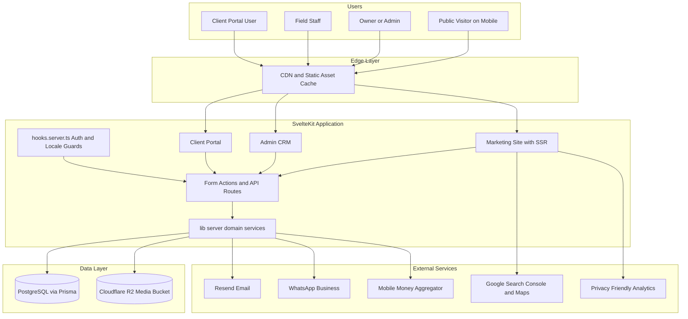
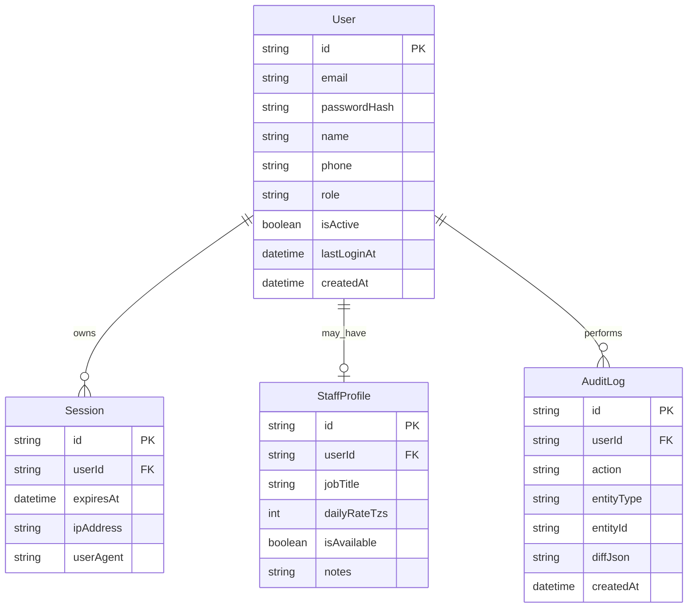
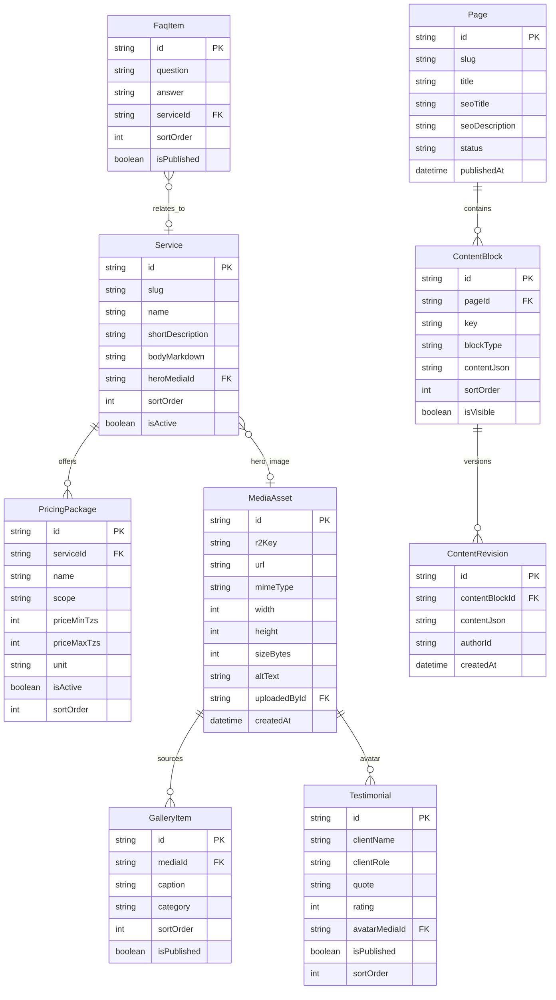
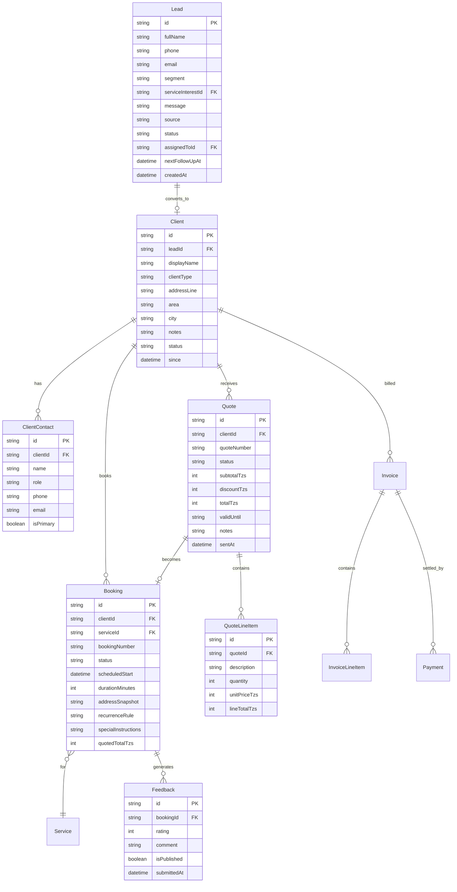
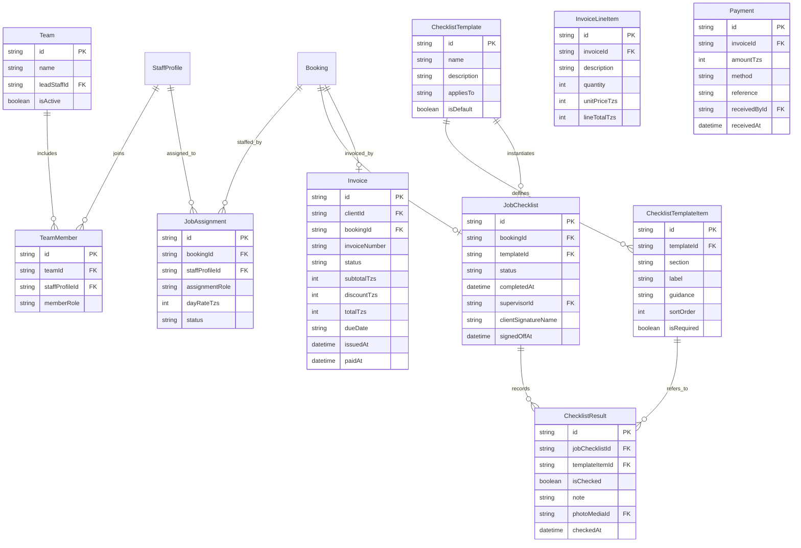
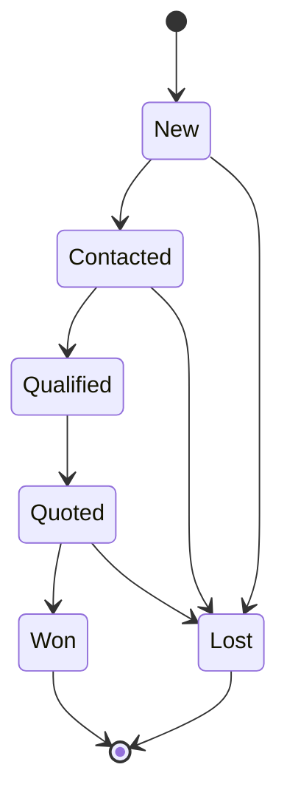
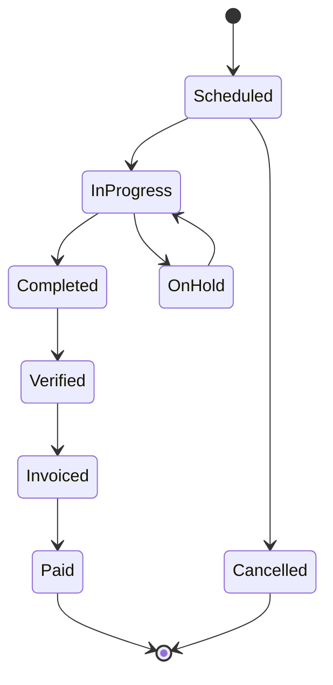
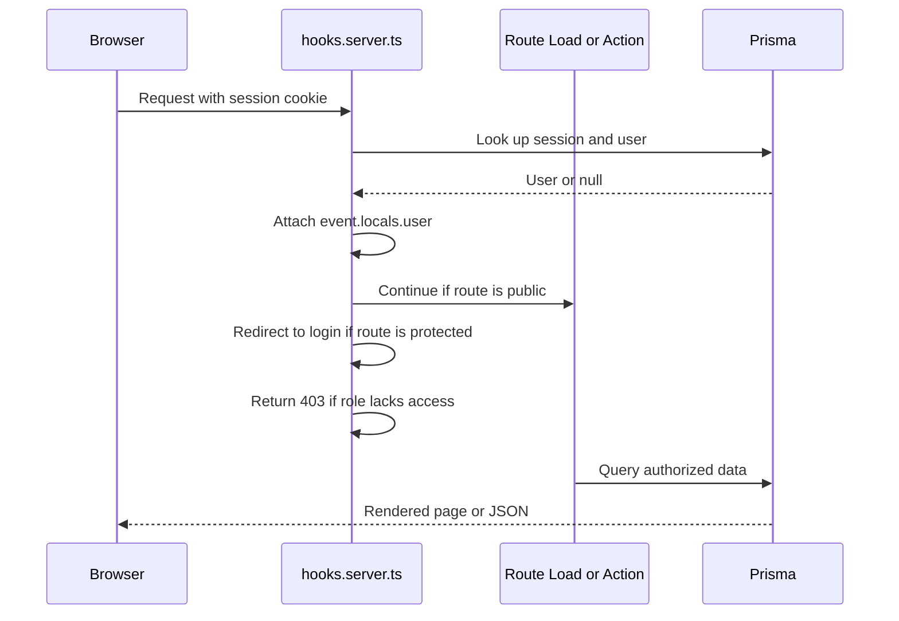
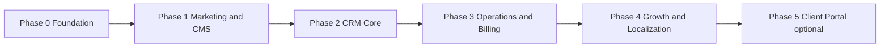

# Melles Cleaning Services — System Architecture

**Product:** Public marketing website + owner-administered CRM for a residential and commercial cleaning business.
**Location:** Dodoma, Tanzania · **Currency:** TZS · **Timezone:** Africa/Dar_es_Salaam (EAT, UTC+3)
**Status:** Draft for review
**Application root:** `C:/Users/eddie/OneDrive/Documents/Web Projects/melles-cleaning`

---

## 1. Purpose and Scope

Melles Cleaning Services needs two things delivered as one deployable SvelteKit application:

1. **A public marketing website** that presents services, pricing, social proof, and captures new leads/bookings.
2. **An internal CRM** that lets the owner (non-technical) run day-to-day operations and update site content without touching code.

This document defines the technical architecture, data model, module boundaries, integration points, and a phased delivery roadmap. It is intentionally decoupled from implementation detail so it can be reviewed and approved before coding begins.

### In scope

- Marketing site with CMS-managed content
- Lead capture and pipeline management
- Client, job, and scheduling management
- Checklist-driven quality control and post-service feedback
- Quotes, invoices, and payment recording in TZS
- Staff, teams, and assignment
- Bilingual English/Swahili content
- Notifications via email and WhatsApp

### Out of scope for the initial build

- Native mobile apps
- Real-time GPS fleet tracking
- Automated payroll and statutory tax filing
- Live card acquiring (mobile money is recorded/manual first, integrated later)

---

## 2. Product Goals

### Public site

- Communicate services, transparent tiered pricing, and trust signals (uniforms, vetted staff, checklists).
- Convert visitors through a low-friction booking/quote request form and click-to-chat WhatsApp.
- Rank for "cleaning services in Dodoma" via SEO, structured data, and a Google Business profile.
- Load fast on mobile networks and low-end Android devices.

### CRM

- One place for the owner to manage the full lifecycle: lead → quote → booking → job → checklist → feedback → invoice → payment.
- Zero-code content editing for hero copy, services, pricing, testimonials, gallery, FAQ, and contact details.
- Operational visibility: upcoming jobs, overdue invoices, pipeline value, monthly revenue, recurring retention.

---

## 3. Guiding Principles and Constraints

| Principle                    | Implication                                                                 |
| ---------------------------- | --------------------------------------------------------------------------- |
| Lean startup, low overhead   | Managed/serverless services; no always-on infrastructure to babysit         |
| Owner is non-technical       | Structured field editing, no raw HTML, safe publish workflow                |
| Mobile-first audience        | Responsive UI, small bundles, optimistic forms, WhatsApp as primary channel |
| Low bandwidth                | SSR, image optimization, aggressive caching, minimal client JS              |
| Single codebase              | Marketing, admin, and portal share one SvelteKit app and one data layer     |
| Phased, reinvest-as-you-grow | Each phase ships independently and is useful on its own                     |
| Tanzania data context        | TZS integer amounts, EAT timezone, mobile money rails, PDPA 2022 awareness  |

---

## 4. Technology Stack

| Layer      | Choice                                                                                    | Rationale                                                                                                   |
| ---------- | ----------------------------------------------------------------------------------------- | ----------------------------------------------------------------------------------------------------------- |
| Framework  | **SvelteKit 3 + Svelte 5 (runes)**                                                        | Already scaffolded; SSR + form actions fit a content + CRUD app                                             |
| Language   | **TypeScript** (strict)                                                                   | Already enabled in [`tsconfig.json`](../../Web%20Projects/melles-cleaning/tsconfig.json)                    |
| Build      | **Vite 8**, **pnpm 10.22.0**                                                              | Already configured and pinned                                                                               |
| Styling    | **Tailwind CSS v4** + shadcn-svelte + Lucide icons                                        | Fast, consistent, accessible primitives                                                                     |
| Database   | **PostgreSQL** (Neon or Supabase)                                                         | Managed, cheap to start, relational fit for CRM                                                             |
| ORM        | **Prisma**                                                                                | Matches existing team familiarity; migration workflow                                                       |
| Validation | **Zod**                                                                                   | Shared schemas for forms and server actions                                                                 |
| Auth       | **Custom session auth** (Lucia-style) with Argon2/bcrypt                                  | Full control, no vendor lock-in for an internal CRM                                                         |
| Media      | **Cloudflare R2** (S3 API + presigned uploads)                                            | Cheap egress, matches existing tooling                                                                      |
| Email      | **Resend**                                                                                | Transactional notifications and confirmations                                                               |
| Messaging  | **WhatsApp click-to-chat** first, Cloud API later                                         | Where the customer base actually communicates                                                               |
| Payments   | Manual recording first, then a **mobile money aggregator** (Selcom / ClickPesa / AzamPay) | M-Pesa, Tigo Pesa, Airtel Money, Halopesa                                                                   |
| Charts     | **LayerChart** or Chart.js                                                                | Dashboard KPIs                                                                                              |
| i18n       | **Paraglide JS** for SvelteKit                                                            | Compile-time, tree-shakeable EN/SW routing                                                                  |
| Dates      | **date-fns** with `Africa/Dar_es_Salaam`                                                  | Correct scheduling and display                                                                              |
| Testing    | **Vitest** (unit) + **Playwright** (e2e)                                                  | Guard critical money and scheduling flows                                                                   |
| Deploy     | **adapter-vercel** or **adapter-cloudflare**                                              | Swaps the current `adapter-auto` in [`vite.config.ts`](../../Web%20Projects/melles-cleaning/vite.config.ts) |

---

## 5. High-Level Architecture



**Request flow for the public site:** CDN → SvelteKit SSR load function → domain service → Prisma → cacheable HTML.
**Request flow for the CRM:** authenticated request → `hooks.server.ts` session check and role guard → form action or load → domain service → Prisma → JSON/HTML.

---

## 6. Route Structure

SvelteKit route groups separate the three surfaces. Route groups (`(name)`) do not affect URLs.

```text
src/routes/
├── (marketing)/
│   ├── +layout.svelte                 public header + footer + JSON-LD
│   ├── +layout.server.ts              loads site settings, nav, locale
│   ├── +page.svelte                   home
│   ├── services/+page.svelte
│   ├── services/[slug]/+page.ts       dynamic service detail
│   ├── pricing/+page.svelte
│   ├── gallery/+page.svelte
│   ├── about/+page.svelte
│   ├── faq/+page.svelte
│   ├── contact/+page.svelte
│   ├── book/+page.svelte              booking / quote request
│   └── book/+page.server.ts           validate + create Lead
├── (auth)/
│   ├── login/+page.server.ts
│   ├── logout/+server.ts
│   ├── forgot-password/+page.server.ts
│   └── reset-password/[token]/+page.server.ts
├── (admin)/
│   └── admin/
│       ├── +layout.server.ts          role guard, loads current user
│       ├── +layout.svelte             CRM shell: sidebar, topbar
│       ├── +page.svelte               dashboard KPIs
│       ├── leads/                     list, detail, kanban pipeline
│       ├── clients/                   list, detail, contacts, history
│       ├── bookings/                  list, create, detail
│       ├── calendar/                  day/week view, drag to reschedule
│       ├── quotes/                    builder, line items, send
│       ├── invoices/                  generate, send, mark paid
│       ├── payments/                  record mobile money and cash
│       ├── staff/                     profiles, availability, daily rate
│       ├── teams/                     teams and members
│       ├── checklists/                templates + the 20-point QC checklist
│       ├── feedback/                  reviews, ratings, publish toggle
│       ├── content/                   CMS: pages, services, pricing, FAQ, gallery
│       ├── media/                     media library backed by R2
│       ├── reports/                   revenue, retention, utilization
│       └── settings/                  business info, hours, socials, promos
├── (portal)/
│   └── portal/                        PHASE 3+ optional client self-service
│       ├── +layout.server.ts
│       ├── bookings/
│       ├── invoices/
│       └── feedback/
├── api/
│   ├── leads/+server.ts               public lead intake endpoint
│   ├── media/upload/+server.ts        presigned R2 upload
│   └── webhooks/                      email and payment callbacks
├── sitemap.xml/+server.ts
└── robots.txt/+server.ts
```

---

## 7. Data Model

The model is grouped into four bounded areas: **Identity**, **Content**, **CRM**, and **Operations**.

### 7.1 Identity and Access



**Roles:** `OWNER`, `ADMIN`, `SUPERVISOR`, `STAFF`, `CLIENT`. `OWNER` is the single business owner account; `ADMIN` handles content and office tasks; `SUPERVISOR` runs field QA; `STAFF` sees only assigned jobs; `CLIENT` is scoped to their own portal data.

### 7.2 Content and CMS



### 7.3 CRM



### 7.4 Operations: Staffing, Checklists, Billing



### 7.5 Lifecycle State Machines

**Lead**



**Booking and Job**



---

## 8. Content Management Design

The owner edits **structured fields**, never raw HTML. This keeps the site safe, consistent, and fast.

### Editable surfaces

| Area         | Fields                                                                                      |
| ------------ | ------------------------------------------------------------------------------------------- |
| Global       | Business name, logo, tagline, phone, WhatsApp number, email, address, hours, socials        |
| Home         | Hero headline, hero subtext, hero image, CTA labels, service highlights, trust badges       |
| Services     | Name, slug, short description, long body, hero image, feature bullets, ordering, visibility |
| Pricing      | Packages per service: name, scope, min/max TZS, unit, ordering, visibility                  |
| Testimonials | Client name, role, quote, rating, avatar, publish toggle, ordering                          |
| Gallery      | Media, caption, category (residential/commercial/deep clean), publish toggle                |
| FAQ          | Question, answer, related service, ordering, publish toggle                                 |
| About        | Story, mission, team highlights, certifications                                             |
| SEO          | Per-page title, meta description, Open Graph image                                          |
| Promos       | First-clean discount percentage, referral credit amount, active flag                        |

### Workflow

- **Draft / Published** status on pages and publish toggles on repeatable items.
- **ContentRevision** snapshots each meaningful change with author and timestamp; owner can restore.
- **Preview mode** renders unpublished content for logged-in admins.
- **Media library** uploads to R2 via presigned URLs; images are resized/lazy-loaded; alt text is required.
- **Seeding** ships the site pre-populated from the business plan so nothing is blank on first deploy.

---

## 9. CRM Functional Design

| Module     | Core capabilities                                                                                       |
| ---------- | ------------------------------------------------------------------------------------------------------- |
| Dashboard  | Pipeline value, jobs today/this week, monthly revenue, unpaid invoices, recent feedback                 |
| Leads      | Kanban by status, follow-up reminders, source tracking, one-click convert to client                     |
| Clients    | Profile, multiple contacts, service history, recurring schedules, notes, referral credit balance        |
| Bookings   | Create from lead/quote or blank, assign service and team, recurring rules, instructions                 |
| Calendar   | Day/week grid, drag to reschedule, conflict detection, travel buffers                                   |
| Quotes     | Line-item builder, menu price suggestions, discounts, PDF/print, send via email/WhatsApp                |
| Invoices   | Generate from booking or quote, sequential numbering, due dates, aging view                             |
| Payments   | Record cash and mobile money with reference; auto-reconcile invoice status                              |
| Staff      | Profiles, daily rates, availability, assignment history                                                 |
| Teams      | Group staff into crews; crew lead; capacity view                                                        |
| Checklists | Manage templates including the standard 20-point QC checklist; per-job completion with notes and photos |
| Feedback   | Collect rating + comment; publish approved reviews to the site                                          |
| Reports    | Revenue by month/segment, client retention, average job value, team utilization                         |
| Settings   | Business info, hours, promo rules, notification preferences, user management                            |

### The 20-Point Quality Control Checklist

The business plan's checklist is modeled as a `ChecklistTemplate` named "Standard 20-Point QC" with three sections:

- **Living and General Areas** — cobweb removal, touchpoint sanitization, glass and mirrors, surface dusting, floor care, upholstery refresh, waste management
- **Kitchen** — countertop and backsplash sanitization, appliance exteriors, sink and faucet scrubbing, cabinet fronts, floor washing
- **Bathrooms and Restrooms** — toilet disinfection, shower and tub scrubbing, vanity and basin care, mirror polishing, floor and drain sanitation
- **Touchpoints and Finishing** — baseboards and door panels, deodorizing, supervisor walkthrough and client sign-off

Each item is a `ChecklistTemplateItem`; field staff tick `ChecklistResult` rows, optionally attach photos, and the supervisor records the walkthrough and client sign-off on the `JobChecklist`.

---

## 10. Pricing Engine

Prices are stored as **integer TZS** (no decimals) to avoid floating-point errors.

- **Menu packages** carry a `priceMinTzs` and `priceMaxTzs` range, matching the plan's tiers:
  - Standard House Clean — 40,000–60,000 TZS
  - Deep Clean / Move-In / Move-Out — 60,000–120,000 TZS
  - Sofa / Upholstery Cleaning — 30,000–60,000 TZS per set
  - Small Office Reset — 150,000–250,000 TZS monthly retainer
  - Medium Commercial Office — 400,000–800,000 TZS monthly retainer
- **Custom quotes** allow free-form line items for post-construction, event cleanup, and specialized work.
- **Promotions:** first-clean 20% off for new offices; referral credit of 10,000 TZS per converted recurring referral.
- **Recurring discounts** are configurable per frequency.
- All totals are recalculated server-side; the client never dictates final amounts.

---

## 11. Authentication and Authorization

### Mechanism

- Email + password login; passwords hashed with Argon2id (fallback bcrypt).
- Server-side sessions stored in the `Session` table; opaque session ID in an `httpOnly`, `secure`, `sameSite=lax` cookie.
- Session rotation on login; expiry with sliding renewal.
- SvelteKit `form` actions for login/logout give built-in CSRF protection.
- Password reset via single-use, expiring token emailed through Resend.

### Enforcement

All authorization is centralized in [`src/hooks.server.ts`](../../Web%20Projects/melles-cleaning/src/hooks.server.ts):



### Role matrix

| Capability                     | Owner | Admin | Supervisor | Staff    | Client   |
| ------------------------------ | ----- | ----- | ---------- | -------- | -------- |
| Manage users and settings      | Yes   | No    | No         | No       | No       |
| Edit site content              | Yes   | Yes   | No         | No       | No       |
| Manage leads and clients       | Yes   | Yes   | No         | No       | No       |
| Manage quotes and invoices     | Yes   | Yes   | No         | No       | No       |
| Schedule and assign jobs       | Yes   | Yes   | Yes        | No       | No       |
| Complete checklists            | Yes   | Yes   | Yes        | Yes      | No       |
| Submit feedback                | Yes   | Yes   | Yes        | No       | Yes      |
| View own bookings and invoices | Yes   | Yes   | Yes        | Own only | Own only |

---

## 12. Integrations

| Integration           | Phase | Approach                                                                                         |
| --------------------- | ----- | ------------------------------------------------------------------------------------------------ |
| WhatsApp              | 1     | Click-to-chat deep links with prefilled messages; upgrade to Cloud API for automated updates     |
| Email                 | 1     | Resend for booking confirmations, invoices, feedback requests, password resets                   |
| Google Business / SEO | 1     | JSON-LD `LocalBusiness` structured data, sitemap, robots, Search Console verification            |
| Maps                  | 2     | Embed for service area and directions; store area names rather than precise coordinates          |
| Analytics             | 1     | Privacy-friendly analytics plus Search Console                                                   |
| Mobile money          | 3     | Aggregator integration for M-Pesa, Tigo Pesa, Airtel Money, Halopesa with webhook reconciliation |
| Calendar export       | 2     | ICS feed for staff schedules                                                                     |
| SMS fallback          | 3     | Optional gateway for clients without WhatsApp                                                    |

---

## 13. Internationalization

- **Paraglide JS** with locale detection and a `?lang` / path strategy.
- Default locale **English (en)**; secondary **Swahili (sw)**.
- CMS content supports per-locale fields for user-facing copy; services, packages, FAQ, and testimonials store translations alongside the base record.
- Numbers and currency formatted with the `tz` locale context; TZS shown with thousands separators.
- All dates rendered in EAT regardless of viewer timezone.

---

## 14. Non-Functional Requirements

| Category        | Requirement                                                                                                            |
| --------------- | ---------------------------------------------------------------------------------------------------------------------- |
| Performance     | LCP under 2.5s on 4G; initial marketing JS kept minimal; images served as optimized WebP/AVIF                          |
| SEO             | SSR marketing pages, canonical URLs, sitemap, structured data, per-page meta                                           |
| Accessibility   | WCAG 2.1 AA: keyboard navigation, focus states, contrast, form labels, alt text                                        |
| Security        | Hashed passwords, session cookies, server-side authorization, input validation with Zod, rate-limited public endpoints |
| Privacy         | PDPA 2022 awareness; collect minimal PII; documented retention; owner-controlled deletion                              |
| Reliability     | Managed Postgres with automated backups; R2 for durable media; graceful error pages                                    |
| Observability   | Structured server logs, error tracking, basic uptime monitoring                                                        |
| Cost            | Stay within free/low tiers during phases 0–2; scale only from revenue                                                  |
| Maintainability | Feature-scoped folders, shared Zod schemas, typed Prisma client, minimal dependencies                                  |

---

## 15. Proposed Source Layout

```text
src/
├── app.d.ts
├── app.html
├── hooks.server.ts                 session + locale + security headers
├── lib/
│   ├── components/
│   │   ├── marketing/              hero, service card, pricing table, testimonial
│   │   ├── admin/                  data table, kanban, form fields, dialogs
│   │   └── ui/                     shadcn-svelte primitives
│   ├── server/
│   │   ├── auth/                   session create/validate, password hashing
│   │   ├── db.ts                   Prisma client singleton
│   │   ├── crm/                    leads, clients, bookings, quotes, invoices
│   │   ├── content/                CMS read/write, revisions
│   │   ├── media/                  R2 client, presigned URLs
│   │   ├── pricing/                pricing and promotion engine
│   │   ├── notify/                 email and WhatsApp senders
│   │   └── audit/                  audit logging
│   ├── schemas/                    shared Zod schemas
│   ├── utils/                      currency, dates, formatting, slugs
│   └── stores/                     client-side UI state
├── routes/
│   └── (see Route Structure)
├── messages/                       en.json, sw.json for Paraglide
└── static/
prisma/
├── schema.prisma
├── migrations/
└── seed.ts
```

---

## 16. Environment Variables

| Variable                                    | Purpose                                              |
| ------------------------------------------- | ---------------------------------------------------- |
| `DATABASE_URL`                              | PostgreSQL connection string                         |
| `DIRECT_URL`                                | Direct connection for migrations when using a pooler |
| `AUTH_SECRET`                               | Session signing/encryption secret                    |
| `PUBLIC_SITE_URL`                           | Canonical site URL for SEO and links                 |
| `PUBLIC_BUSINESS_PHONE`                     | Displayed contact number                             |
| `PUBLIC_WHATSAPP_NUMBER`                    | WhatsApp click-to-chat target                        |
| `R2_ACCOUNT_ID`                             | Cloudflare account identifier                        |
| `R2_ACCESS_KEY_ID` / `R2_SECRET_ACCESS_KEY` | R2 S3 credentials                                    |
| `R2_BUCKET` / `R2_PUBLIC_URL`               | Media bucket and public base URL                     |
| `RESEND_API_KEY`                            | Email delivery                                       |
| `MAIL_FROM`                                 | Verified sender address                              |
| `PAYMENTS_API_KEY`                          | Mobile money aggregator (phase 3)                    |
| `PAYMENTS_WEBHOOK_SECRET`                   | Webhook verification (phase 3)                       |

Secrets live only in the deployment environment; `.env` files stay local. [`src/app.d.ts`](../../Web%20Projects/melles-cleaning/src/app.d.ts) will be extended to type `App.Locals.user` and `App.Platform`.

---

## 17. Deployment and Operations

- **Adapter:** replace `adapter-auto` in [`vite.config.ts`](../../Web%20Projects/melles-cleaning/vite.config.ts) with the chosen target (`adapter-vercel` or `adapter-cloudflare`).
- **Database:** Neon or Supabase Postgres; migrations applied with `prisma migrate deploy` during release.
- **Media:** R2 bucket with public-read via custom domain or signed URLs.
- **CI:** install with pnpm, run `pnpm check`, unit tests, and a production build on every push.
- **Seeding:** `prisma/seed.ts` populates services, pricing packages, the 20-point checklist template, FAQ, and default page content.
- **Backups:** rely on managed Postgres point-in-time recovery; export media metadata periodically.

---

## 18. Phased Delivery Roadmap

Each phase is independently shippable and useful. No time estimates are implied; sequencing is what matters.



| Phase                            | Deliverables                                                                                                              | Outcome                                     |
| -------------------------------- | ------------------------------------------------------------------------------------------------------------------------- | ------------------------------------------- |
| **0 — Foundation**               | Tailwind + design tokens, Prisma + Postgres, base layouts, auth, role guards, settings model, CI                          | Runnable app shell with secure login        |
| **1 — Marketing and CMS**        | Marketing routes, content models, media library on R2, seed data, SEO + JSON-LD, contact and booking form capturing leads | Public site the owner can edit without code |
| **2 — CRM Core**                 | Dashboard, leads pipeline, clients, bookings, calendar, staff, teams                                                      | Owner runs daily scheduling and sales       |
| **3 — Operations and Billing**   | Checklists, feedback, quotes, invoices, payments, reports                                                                 | Full job-to-cash cycle with QA              |
| **4 — Growth and Localization**  | Swahili localization, WhatsApp automation, mobile money integration, referral and promo automation, analytics             | Reach and conversion at scale               |
| **5 — Client Portal (optional)** | Client login, upcoming bookings, invoices, feedback history                                                               | Self-service for recurring clients          |

---

## 19. Risks and Mitigations

| Risk                                     | Mitigation                                                               |
| ---------------------------------------- | ------------------------------------------------------------------------ |
| Owner non-technical, could break content | Structured fields, draft/publish, revisions, no raw HTML                 |
| Low-end devices and slow networks        | SSR, small JS budget, optimized media, progressive enhancement           |
| Payment integration complexity           | Defer to phase 3; record manually first so the business is never blocked |
| Pricing drift and discount abuse         | Server-side totals, validated promotion rules, audit log                 |
| Data loss on free database tiers         | Managed backups and scheduled exports                                    |
| Scope creep across marketing + CRM       | Phased roadmap with independent shippable milestones                     |
| Swahili translation quality              | Human review before publishing; keep copy short and structured           |

---

## 20. Open Decisions

The following decisions should be confirmed before implementation.

| Decision            | Recommended default          | Alternatives                        |
| ------------------- | ---------------------------- | ----------------------------------- |
| Deployment target   | Vercel with `adapter-vercel` | Cloudflare Pages, Netlify, Node VPS |
| Database host       | Neon Postgres                | Supabase, Railway                   |
| Auth approach       | Custom session auth in-app   | Supabase Auth, Better Auth          |
| Media storage       | Cloudflare R2                | UploadThing, Supabase Storage       |
| i18n package        | Paraglide JS                 | svelte-i18n, typesafe-i18n          |
| Payments aggregator | Defer to phase 3             | Selcom, ClickPesa, AzamPay          |
| Client portal       | Defer to phase 5             | Build in phase 2                    |
| Blog / news module  | Defer                        | Include in phase 1                  |

---

## 21. Summary

One SvelteKit application serves a fast, bilingual marketing site and a role-based CRM over a single PostgreSQL schema managed by Prisma, with media on R2 and notifications through Resend and WhatsApp. Content is modeled as safe structured fields the owner can publish without developer help, and the business plan's pricing tiers and 20-point quality checklist are first-class data in the system. Delivery is phased so each step produces standalone value while the lean, low-overhead constraint is respected.
